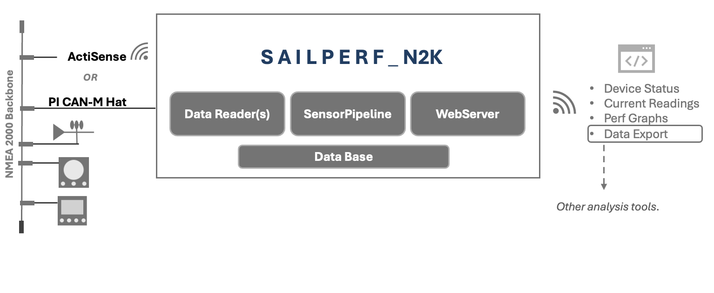
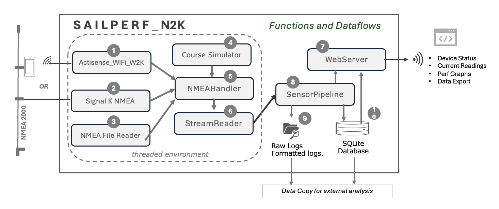

<!--    -->


<!--  [](https://example.com/get-started) -->

<!-- [](https://example.com/docs) -->


### S A I L P E R F - N2K* is an open-source Python library for logging and displaying NMEA2000 data for sailboat performance analysis.  

⚠️ **Caution:** S A I L P E R F - N2K is in early beta development, many functions are still being developed and tested.




### Features

- Connects to NMEA 2000 Actisense  W2K1 reader or a  PI CAN M Raspberry pie hat(in testing).
- Runs on Raspberry PI ( 3 or higher ) or windows / Mac/ Linux device. 
- Can operate headless (no screen/ keyboard needed)


### Functions:
- Identify N2K devices   
- Broadcast N2K data to any browser  
- Logging N2K data specific to analyzing boat performance
- Aggregate data from non N2K devices (i.e. Velociteck / Varakos) 
- Export data to other analsysis tools (CSV)   
- Creating synthetic simulation data  
- Post Race Anaysis
- - Same speed on different tacks.
-  - Boat trim consistency (fore-aft, heel).
- - Start line acceleration.
- - Sail to theoretical polars.
- - Acceleration times for start time (from sails flapping to hull speed, wind, crew).
- - Time at hull speed (minutes).
- - Comparative analysis and benchmarking.




1.  ActiSence: The Actisense W2K-1 is a compact, low-power NMEA 2000 to Wi-Fi gateway with data logging capabilities.
2.  Signal K:  A library used for reading NMEA 2000 data from a Raspberry Pi with a PiCAN Hat. 
3.  NMEA File Reader:   Used to send a  existing NMEA log file for analysis.
4.  Course Simulator:  Used to create race courses with common polars for testing. 
5.  NMEA Handler: Parses data for each NMEA Talker ID and some PGNs.
6.  Stream Reader:  Reads realtime socket data in a thread. 
7.  WebServer:  CherryPy Web server provides UI and admin functions. 
8.  SensorPipeline: Holds 'point in time' data.
9.  Raw Logs:  Raw and processed data in ASCII format.
10. SQLite:  A lightweight SQLite database for data storage..


## Installation
1. Clone the repository:
   ```bash
   git clone https://github.com/lindsaymcrory/sailperf_n2k.git  
   rm -rf .git


##### **Usage**
Explain how users can run the project and interact with it.
1) Install with Actisence, 
2) Install with Raspberry PI-CAN Hat,
3) Use in standalone mode.


### Limitations 
-Not a e

## Screenshots


## License
Licensed under the [Apache 2.0 License](LICENSE).